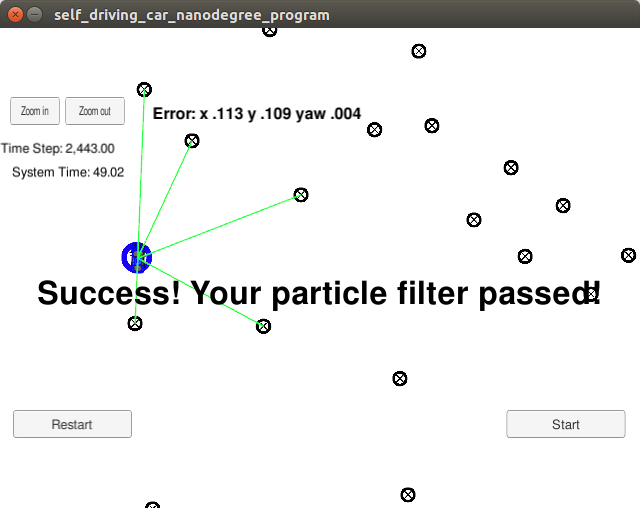

# Extended Kalman Filter
This Project is the eighth task (Project 3 of Term 2) of the Udacity Self-Driving Car Nanodegree program. 

The main goal of the project is to apply Particle Filter to localize a self driving car using C++.

The project was created with the Udacity [Starter Code](https://github.com/udacity/CarND-Kidnapped-Vehicle-Project).

## Content of this repo
```
root
|   build.sh
|   clean.sh
|   CMakeLists.txt
|   README.md
|   particle-filter.png
|   run.sh
|
|___data
|   |   
|   |   map_data.txt
|   
|   
|___src
    |   helper_functions.h
    |   main.cpp
    |   map.h
    |   particle_filter.cpp    'I only modified this file to meet the require of this project'
    |   particle_filter.h
```


## Result



Accuracy - (x,y,yaw) errors: [0.113, 0.109, 0.004]


## How to run the code
Clone this repo and perform 
```
mkdir build && cd build
cmake ..
sudo make
./particle_filter
```
For details, see [README_old.md](README_old.md)


